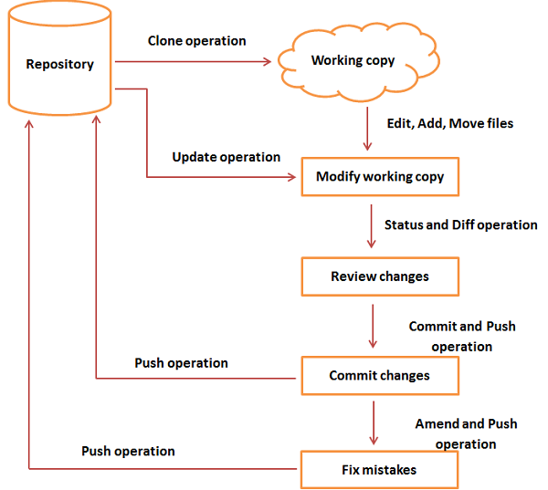
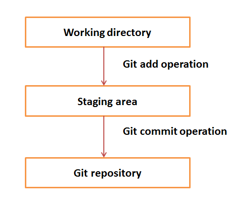

# GitHub Documentation
This documentation is a simplified overview of Git and the basic functionality of the Git version control system. It also serves as a "how to" on getting a solution from GitHub, working through a development loop that includes management of local and remote repositories, branching, syncing branches and committing files to the repositories.

# Version Control System
Version Control System (VCS) is software that helps software developers to work together and maintain a complete history of their work.

Listed below are the functions of a VCS:
 - A complete long-term change history of every file.
 - Branching and merging allows individuals to benefit from the ability to work on independent streams of changes.
 - Traceability means tracking each change made to the software and connect it to project management and bug tracking software.
 
Git is a distributed version control system (DVCS). DVCS clients check out the latest snapshot of a directory that fully mirrors the repository. You can commit changes, create branches, view logs, and perform other operations on both remote and local repositories. Every checkout is a full backup of the repository.

# Local Repository

Every VCS tool provides a private workplace as a working copy for each user. Developers make changes in their private workplace and after commit, these changes become a part of the repository. Git takes it one step further by providing the user a private copy of the whole repository. Users can perform many operations with this repository such as add file, remove file, rename file, move file, commit changes, and many more.

# Working Directory and Staging Area

The working directory is the place where files are checked out. Git uses a different strategy. Git doesn’t track each and every modified file. Whenever you do commit an operation, Git looks for the files present in the staging area. Only those files present in the staging area are considered for commit and not all the modified files.

# Basic Workflow of Git.

Step 1 − You modify a file from the working directory.
Step 2 − You add these files to the staging area.
Step 3 − You perform commit operation that moves the files from the staging area. After push operation, it stores the changes permanently to the Git repository.

# Branches
Branches are used to create another line of development. By default, Git has a master branch. Usually, a branch is created to work on a new feature. Once the feature is completed, it is merged back with the master branch and we delete the branch. Every branch points to the latest commit in the branch.

# Pull
Pull operation copies the changes from a remote repository instance to a local one. The pull operation is used for synchronization between two repository instances.

# Push
Push operation copies changes from a local repository instance to a remote one. This is used to store the changes permanently into the Git repository.

# Git Life Cycle

The life cycle of Git includes a workflow with associated commands for each operation.

The general workflow is as follows:
 - Clone the Git repository as a working copy (staging area).
 - Modify the working copy by adding/deleting/editing files.
 - If necessary, you can update the working copy (staging area) with other developer's changes.
 - You review the changes before committing them to the local and remote repositories.
 - If you're satisfied with the changes, then you push the changes to the repository.





# Getting Started

Configure Git

Introduce yourself to Git with your name and public email address before doing any operation.
```bash
$ git config --global user.name "Your Name Comes Here"
$ git config --global user.email you@yourdomain.example.com
```
Setting up a repository

To download a copy of an existing repository:
```bash
$ git clone git://git.kernel.org/pub/scm/git/git.git
```
The clone command creates a new directory named after the project. After you cd into this directory, you will see that it contains a copy of the project files, called the working tree, together with a special top-level directory named .git, which contains all the information about the history of the project.

To import a new set of files and place them under Git revision control:
```bash
$ cd yourprojectfolder
$ git init
```

Tell Git to take a snapshot of the contents of all files under the current directory (note the .), with git add:
```bash
$ git add .
```
This snapshot is now stored in a temporary staging area which Git calls the "index". You can permanently store the contents of the index in the repository with git commit:
```bash
$ git commit
```

Making Changes

Modify some files, then add their updated contents to the index:
```bash
$ git add file1 file2 file3
```
To get a brief summary of the current situation:
```bash
$ git status
On branch master
Changes to be committed:
Your branch is up to date with 'origin/master'.
(use "git restore --staged <file>..." to unstage)

modified:   file1
modified:   file2
modified:   file3
```

Managing Branches

A single Git repository can maintain multiple branches of development. To create a new branch named "experimental":
```bash
$ git branch experimental
```

To get a list of all branches:
```bash
$ git branch
```
The "experimental" branch is the one you just created, and the "master" branch is a default branch that was created for you automatically.

To switch to the experimental branch:
```bash
$ git switch experimental
```

To merge changes from the new branch into the master branch:
```bash
$ git switch master
$ git merge experimental
```

At this point you could delete the new branch:
```bash
$ git branch -d experimental
```
